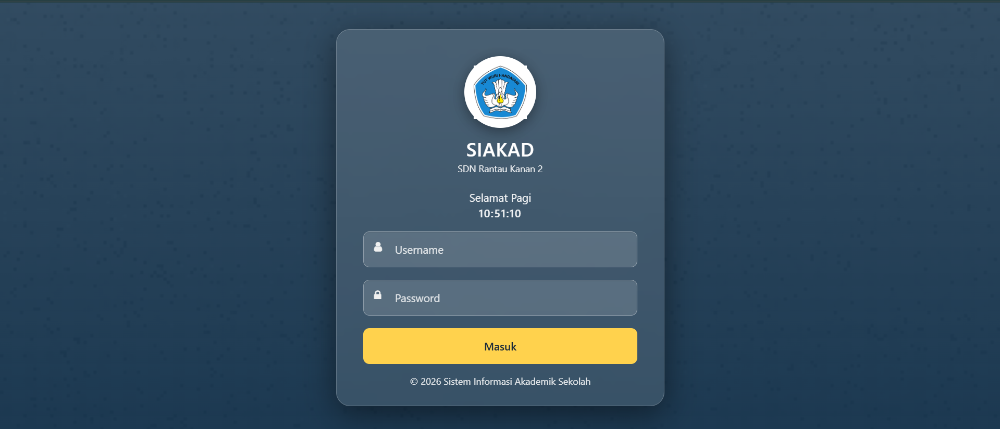
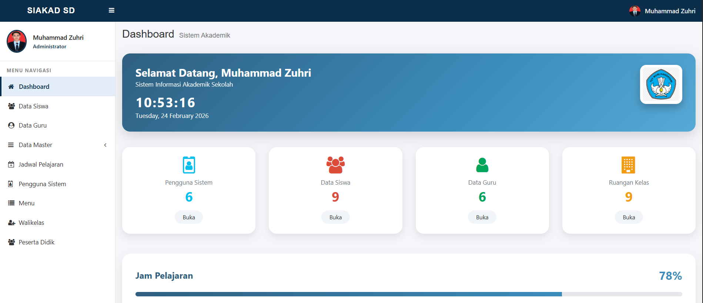
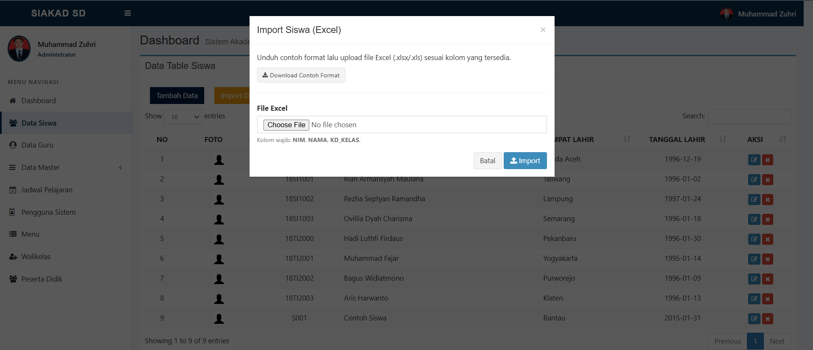
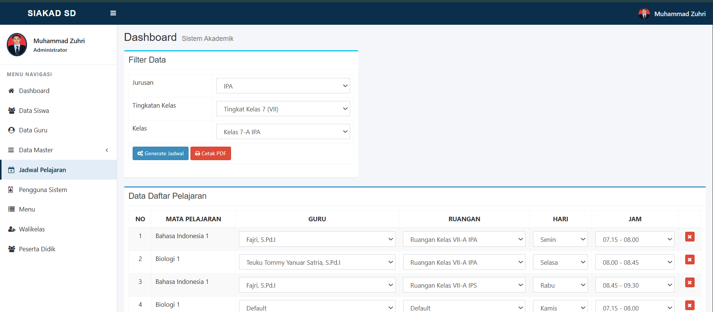

# Aplikasi Akademik Sekolah Berbasis Web

Contoh akses aplikasi (sesuaikan port/local server kamu):

- Login: `http://localhost:2027/auth`
- Dashboard: `http://localhost:2027/tampilan_utama`

## Tampilan Aplikasi

## Fitur

- Multi role/level user (menu dinamis per role)
- Login berbasis session + flash message (auto hilang sekitar 10 detik)
- CRUD Master: Siswa, Guru, Mapel, Ruangan, Tingkatan Kelas, Jurusan, Kelas, Kurikulum, Tahun Akademik
- Walikelas: menu/fitur khusus walikelas (hanya tampil jika user terdaftar sebagai walikelas pada tahun akademik aktif)
- Jadwal Pelajaran: generate & cetak PDF jadwal
- Nilai: input nilai siswa & laporan nilai (role Guru/Walikelas sesuai hak akses)
- Export Data Siswa ke Excel (`.xlsx`)
- Import Data Siswa via Excel (`.xlsx/.xls`) lewat modal + download template contoh format

## Requirement

- PHP 8.1+ (direkomendasikan PHP 8.4)
- MySQL/MariaDB
- Web server (Apache/Nginx) + mod_rewrite (jika memakai Apache)

## Login

|     Level     | Username | Password |
| :-----------: | :------: | -------: |
| Administrator |  zuhri   |   123456 |
|  Wali Kelas   |   adam   |   123456 |
|     Guru      |   dita   |   123456 |
|   Keuangan    |  putri   |   123456 |
